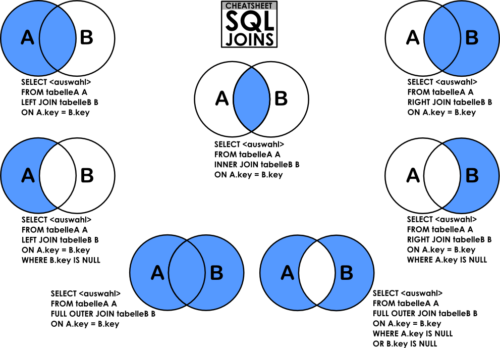

# Experimentos de Avaliação de Desempenho

## Elaboração das Consultas SQL

Para cada consulta, traduzi-la para SQL e adcionar que operações ela abrange.
*Nota: o postgree trata tabelas e colunas como case-sensitive, então vamos padronizar usar eles entre aspas duplas (O MySql entende)*

# Consultas Planejadas

| **ID** | **Nome da ação** | **Consulta SQL Relacionada** | **Consulta Otimizada** | **Justificativa da Consulta** | **O que essa consulta abrange** |
|-----|--------------|--------------------------|--------------------------|-----------------------------|------------------------------|
| 1 | Inserir novo usuário | `INSERT INTO "Users" ("Id", "Reputation", "CreationDate", "DisplayName", "LastAccessDate", "Views", "UpVotes", "DownVotes") VALUES (9999999, 1, NOW(), 'User', NOW(), 0, 0, 0);` | consulta otimizada | justifica_otimização | Inserção de registros |
| 2 | Atualizar novo usuário | `UPDATE "Users" SET "DisplayName" = "TestUser" WHERE "Id" = 9999999; ` | consulta otimizada | justifica_otimização | Alteração de registros com subconsulta em chave primária|
| 3 | Remover novo usuário de teste | `DELETE FROM "Users" WHERE "Id" = 9999999;` | consulta otimizada | justifica_otimização | Remoção de registros com subconsulta em chave primária|
| 4 | Atualizar reputação | `UPDATE "Users" SET "Reputation" = "Reputation" + 10 WHERE "Id" = 1;` | consulta otimizada | justifica_otimização | Alteração de registros |
| 5 | Atualizar reputação em -10 para usuários que possuem postagens que foram votadas como como Spam| `` | consulta otimizada | justifica_otimização | Alteração de registros com subconsulta |
| 6 | Busca por chave primária (única) | `SELECT * FROM "Posts" WHERE "Id" = 1000;` | consulta otimizada | justifica_otimização | Busca por chave primária (ponto) |
| 7 | Busca por faixa de chaves primárias | `SELECT "Id", "Title", "CreationDate" FROM "Posts" WHERE "Id" BETWEEN 5000 AND 5050;` | consulta otimizada | justifica_otimização | Busca por chave primária (faixa) |
| 8 |  Listar usuários que fizeram posts votados como 12-spam, trazer o indentificador de perfil e seus respectivos posts (Title, Body, CreationDate, ClosedDate) | `SELECT DISTINCT u."Id" AS "UserId", p."Id" AS "PostId", p."Title", p."Body", p."CreationDate", p."ClosedDate" FROM "Votes" v JOIN "Posts" p ON v."PostId" = p."Id" JOIN "Users" u ON p."OwnerUserId" = u."Id" WHERE v."VoteTypeId" = 12 AND p."OwnerUserId" IS NOT NULL;` |`SELECT u."Id" AS "UserId", p."Id" AS "PostId", p."Title", p."Body",p."CreationDate", p."ClosedDate" FROM "Users" u JOIN "Posts" p ON u."Id" = p."OwnerUserId" WHERE EXISTS (SELECT 1 FROM "Votes" v WHERE v."PostId" = p."Id" AND v."VoteTypeId" = 12);` | Sem duplicatas: ao contrário do JOIN ... DISTINCT, o EXISTS não multiplica linhas quando um post tem vários votos Spam, dispensando DISTINCT e a ordenação implícita. | Junções múltiplas, Busca por atributo não‑chave primária, relacionamentos|
| 9 | Posts com score elevado e muitas respostas | `SELECT "Id", "Title", "Score", "AnswerCount" FROM "Posts" WHERE "Score" > 50 AND "AnswerCount" > 5;` | consulta otimizada | justifica_otimização | Busca por atributos não-chave (condição composta) |
| 10 | Usuários com reputação entre 1000 e 5000 | `SELECT "DisplayName", "Reputation", "CreationDate" FROM "Users" WHERE "Reputation" BETWEEN 1000 AND 5000 ORDER BY "CreationDate" DESC;` | consulta otimizada | justifica_otimização | Busca por atributo não-chave (faixa numérica) |
| 11 | Listar todas as postagens que contenham a palavra "SQL" no título ou nas tags. Ordenar por pontuação (Score). | `SELECT "Id", "Title", "Tags", "Score" FROM "Posts" WHERE "Title" LIKE '%SQL%' OR "Tags" LIKE '%SQL%' ORDER BY "Score" DESC;` | | | Busca textual com LIKE + ordenação por Score. |
| 12 | Listar a postagem, a tag da postagem e o número de comentários que contenham a palavra "SQL" no texto. Ordenado pelo score da postagem. | `SELECT p."Id" AS "PostId", p."Tags", COUNT(c."Id") AS "CommentCountSQL" FROM "Posts" p LEFT JOIN "Comments" c ON p."Id" = c."PostId" AND c."Text" LIKE '%SQL%' GROUP BY p."Id", p."Tags", p."Score" ORDER BY p."Score" DESC;` | | | Junção, agregação com condição LIKE, ordenação por Score. |
| 13 | Perguntas e suas respostas (self-join) | `SELECT q."Id" AS "QuestionId", q."Title", a."Id" AS "AnswerId", a."Score" AS "AnswerScore" FROM "Posts" q JOIN "Posts" a ON q."Id" = a."ParentId" WHERE q."PostTypeId" = 1 AND a."PostTypeId" = 2;` | - | - | Junção de uma tabela consigo mesma |
| 14 | Usuários e suas badges | `SELECT u."DisplayName", b."Name" AS "BadgeName", b."Date" FROM "Users" u JOIN "Badges" b ON u."Id" = b."UserId" ORDER BY b."Date" DESC LIMIT 20;` | - | - | Junção entre duas tabelas distintas |
| 15 | Posts mais linkados (referenciados) | `SELECT p."Id", p."Title", COUNT(pl."RelatedPostId") AS "TimesLinked" FROM "Posts" p JOIN "PostLinks" pl ON p."Id" = pl."RelatedPostId" GROUP BY p."Id" ORDER BY "TimesLinked" DESC LIMIT 10;` | - | - | Junção com tabela de relacionamento (PostLinks) + agregação |
| 16 | Usuários que mais votaram e comentaram nos mesmos posts | `SELECT u."DisplayName", COUNT(DISTINCT v."PostId") AS "VotedPosts", COUNT(DISTINCT c."PostId") AS "CommentedPosts" FROM "Users" u LEFT JOIN "Votes" v ON u."Id" = v."UserId" AND v."VoteTypeId" = 2 LEFT JOIN "Comments" c ON u."Id" = c."UserId" GROUP BY u."Id" HAVING COUNT(DISTINCT v."PostId") > 10 AND COUNT(DISTINCT c."PostId") > 5 ORDER BY "VotedPosts" DESC;` | - | - | Múltiplos LEFT JOIN + DISTINCT + múltiplas condições no HAVING |
| 17 | Média de tempo para primeira resposta por mês | `SELECT DATE_TRUNC('month', q."CreationDate") AS "Month", AVG(EXTRACT(EPOCH FROM (a."CreationDate" - q."CreationDate")) / 3600) AS "AvgHoursToFirstAnswer" FROM "Posts" q JOIN "Posts" a ON q."Id" = a."ParentId" WHERE q."PostTypeId" = 1 AND a."PostTypeId" = 2 AND NOT EXISTS (SELECT 1 FROM "Posts" a2 WHERE a2."ParentId" = q."Id" AND a2."PostTypeId" = 2 AND a2."CreationDate" < a."CreationDate") GROUP BY DATE_TRUNC('month', q."CreationDate") ORDER BY "Month";` | - | - | Subconsulta de negação (NOT EXISTS) + agregação temporal |
| 18 | Pontuação média das postagens por usuário | `SELECT "OwnerUserId", AVG("Score") AS "AvgPostScore" FROM "Posts" WHERE "OwnerUserId" IS NOT NULL GROUP BY "OwnerUserId";` | - | - | Agregação (AVG), agrupamento por usuário, filtro de nulos. |
| 19 | Buscar usuários que possuam mais distintivos (badges) | `SELECT u."Id", u."DisplayName", COUNT(b."Id") AS "BadgeCount" FROM "Users" u JOIN "Badges" b ON u."Id" = b."UserId" GROUP BY u."Id", u."DisplayName" ORDER BY "BadgeCount" DESC LIMIT 10;` | - | - | Junção, contagem de badges, ordenação decrescente, limite. |
| 20 | Trazer título, nome do tipo, número de comentários, número de vezes que foi referenciado, soma dos votos positivos e soma dos votos negativos do post do tipo resposta que possui maior número de visualizações | `WITH answer_post AS ( SELECT "Id" FROM "Posts" WHERE "PostTypeId" = 2 ORDER BY "ViewCount" DESC LIMIT 1 ) SELECT p."Title", pt."Type" AS "PostTypeName", COUNT(DISTINCT c."Id") AS "CommentCount", COUNT(DISTINCT pl."Id") AS "ReferencedCount", SUM(CASE WHEN v."VoteTypeId" = 2 THEN 1 ELSE 0 END) AS "UpVoteSum", SUM(CASE WHEN v."VoteTypeId" = 3 THEN 1 ELSE 0 END) AS "DownVoteSum" FROM "Posts" p JOIN "PostTypes" pt ON p."PostTypeId" = pt."Id" LEFT JOIN "Comments" c ON p."Id" = c."PostId" LEFT JOIN "PostLinks" pl ON p."Id" = pl."RelatedPostId" LEFT JOIN "Votes" v ON p."Id" = v."PostId" WHERE p."Id" = (SELECT "Id" FROM answer_post) GROUP BY p."Title", pt."Type";` | - | - | Subconsulta para identificar o post com maior ViewCount (tipo resposta), múltiplas junções (PostTypes, Comments, PostLinks, Votes), agregação com contagens distintas e soma condicional (up/down votes). |

### Checklist: Consultas solicitas na descrição do projeto

- [x] Operações de inserção de registros em diferentes tabelas
- [x] Operações de remoção de registros em diferentes tabelas
- [x] Operações de alteração (update) de registros em diferentes tabelas
- [x] Busca de registros por chave primária (um único valor)
- [x] Busca de registros por faixa de chaves primárias (range)
- [ ] Buscas por atributos não-chave (simples)
- [ ] Buscas com condições de seleção compostas (vários atributos não-chave)
- [ ] Buscas com padrão de string usando operador LIKE
- [ ] Buscas envolvendo relacionamentos (junções entre duas tabelas)
- [ ] Buscas envolvendo junções de junções (múltiplas junções)
- [ ] Buscas envolvendo subconsultas (simples ou correlacionadas)
- [ ] Buscas envolvendo operações de agrupamento (GROUP BY)
- [ ] Buscas envolvendo funções de agregação (soma, média, mínimo, máximo, contagem)
- [ ] Consultas que se beneficiem de índices full-text (busca por palavras em textos longos, como Posts.Body ou Users.AboutMe)

## Criação de Índices e Definição de Cenários

Cenário I. Cenário Base sem índices utilizando o MySQL

Cenário II. Cenário Base sem índices utilizando o PostgreSQL

1. **Banco de dados sem índices**
- Cenário I. Cenário Base sem índices utilizando o MySQL
- Cenário II. Cenário Base sem índices utilizando o PostgreSQL
2. Cenários com índices:
   - Criados sobre diferentes atributos
   - Utilizando diferentes estruturas:
     - **Árvore B+**
     - **Hash**

- Identificar **quais índices trazem maior ganho de desempenho**.
   1. Pesquisar sobre ferramentas de testes de índices 

---

## Execução dos Experimentos

- Cada consulta deve ser executada **múltiplas vezes em cada cenário**.
- O tempo de execução pode variar devido a fatores como:
  - Carga da máquina
  - Paginação do sistema operacional
  - Cache do SGBD/SO

### Recomendação importante:
- **Minimizar interferências externas**, como outros programas em execução.

---
## Coleta de Dados

- Desenvolver **programas ou scripts** para:
  - Executar as operações nos SGBDs
  - Coletar os **tempos de execução**

- Para cada:
  - **SGBD**
  - **Cenário**
  
  Executar cada operação **pelo menos 20 vezes**.
